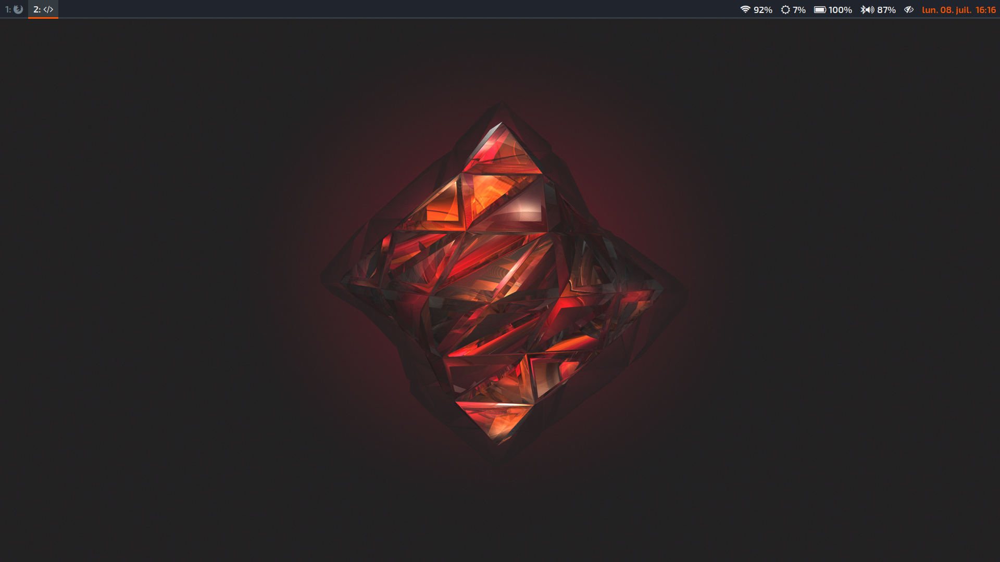

# Usage

On the first run, you'll have to use this command to fetch the latest info for the necessary github repos:

```bash
sudo -- sh -c 'nix-prefetch-git https://github.com/aveltras/nix > /etc/nixos/nix.json; nix-prefetch-git https://github.com/rycee/home-manager > /etc/nixos/home-manager.json'
```
Once configured via this repo, the shell alias **update-nix** will do the same.

Next, switch the content of your **/etc/nixos/configuration.nix** to:

```nix
# /etc/nixos/configuration.nix
let thunk = builtins.fromJSON (builtins.readFile /etc/nixos/nix.json);
in import (builtins.fetchTarball {
     url = "https://github.com/aveltras/nix/archive/${thunk.rev}.tar.gz";
     sha256 = thunk.sha256;
   }) "clevo-N141ZU"
```

The last argument (here **clevo-N141ZU**) should correspond to a physical machine specific configuration file in the "hosts" directory.

You can then run `sudo nixos-rebuild switch` as usual.

## Local configuration

It's possible to test changes without having to push/pull from the distant repo.
In order to do this, pull this repo locally and point your rebuilds to an alternative **configuration.nix**.

```nix
# /etc/nixos/configuration-local.nix
import /path/to/local/checkout "clevo-N141ZU"
```
Then to rebuild using this temporary configuration:

```bash
sudo nixos-rebuild switch -I nixos-config=/etc/nixos/configuration-local.nix
```

## Preview

